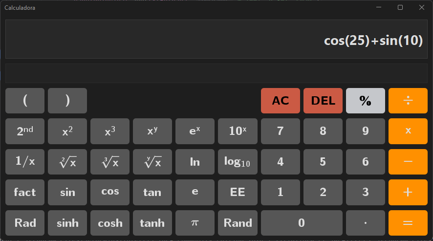

# Calculadora
- Creada en JAVA en [IntelliJ](https://www.jetbrains.com/idea/)
- JDK Java 22
- Author: Daniel Arias
- Author: Andres Hernandez

# Librerias Usadas
- [Flatlaf-3.4.1](https://www.formdev.com/flatlaf/) dieseño de la interfaz de usuario.
- [Flatlaf-intellij-themes](https://www.formdev.com/flatlaf/) temas usados.
- [Jep-java-4.0-trial](https://www.singularsys.com/jep/) para evaluar la expresion matematica.
- [Jlatexmath-1.0.7](https://mvnrepository.com/artifact/org.scilab.forge/jlatexmath) para poder darle mejor diseño a los botones usando latex.
- [Miglayout-swing-11.3 y miglayout-core-11.3](http://www.miglayout.com/) para el layout de la interfaz.

# Ejecución
- Instalar las librerias que estan en el archivo: 🔗[Librerias](./librerias/)

# Referencia
